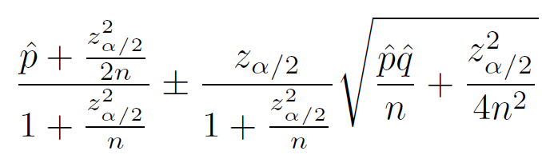

\newcommand{\Var}[1]{\text{Var}\left( #1 \right)}
\newcommand{\E}[1]{E\left( #1 \right)}
\newcommand{\Sample}[1]{#1_1,\ldots,#1_n}
\newcommand{\od}[2]{\overline #1_{#2\cdot}}
\newcommand{\flist}[2]{\{#1_1, #1_2, \ldots, #1_#2\}}
\newcommand{\samp}[2]{#1_1, #1_2, \ldots, #1_#2}
\renewcommand{\bar}[1]{\overline{#1}}


```{r, include=FALSE}
knitr::opts_chunk$set(fig.width = 4, fig.height = 4, fig.align = "center")
```

# A taste of categorical data 9.10, 10.13

## Example "gas pipeline data"

```{r, echo=FALSE, message=FALSE}
library(dplyr)
library(rio)
library(ggplot2)
library(knitr)
library(xtable)

set.seed(1)
n <- 1000
pipeline <- data_frame(Leak = sample(c("Yes", "No"), n, prob = c(0.2,0.8), TRUE),
                       Size = sample(c(1.5, 1.0, 1.75), n, prob=c(0.3, 0.4, 0.3), TRUE),
                       Material = sample(c("Steel", "Aldyl A"), n, TRUE),
                       Pressure = sample(c("Low", "Med", "High"), n, TRUE))
```

|Leak | Size|Material |Pressure |
|:----|----:|:--------|:--------|
|No   | 1.00|Aldyl A  |Low      |
|No   | 1.00|Steel    |Med      |
|No   | 1.50|Aldyl A  |Low      |
|Yes  | 1.50|Aldyl A  |Low      |
|No   | 1.50|Steel    |Med      |
|Yes  | 1.75|Aldyl A  |Low      |
|Yes  | 1.00|Aldyl A  |Med      |
|... |... |... |... |

## Numbers of interest

* Counts and *proportions* of one- and multi-way classifications. 

* One-way on `Leak`:

```{r, echo=FALSE}
pipeline %>% 
  group_by(Leak) %>% 
  summarize(Count=n()) %>% 
  mutate(Proportion = Count/sum(Count))
```

* Note: avoid "percentages", which are really just a way of formatting proportions for human visual consumption.

## numbers...two-way classification 

* A few different styles...

```{r, echo=FALSE}
with(pipeline, table(Leak, Size))
```

```{r, echo=FALSE}
pipeline %>% 
  group_by(Leak, Size) %>% 
  summarise(n = n())
```

## numbers...two-way classification

* Adding marginal totals:

```{r, echo=FALSE}
addmargins(with(pipeline, table(Leak, Size)))
```

* Proportions rather than counts:

```{r, echo=FALSE}
addmargins(prop.table(with(pipeline, table(Leak, Size))))
```

## graphical summaries

* Pretty much "bar plot" or "bar chart" and friends

```{r}
pipeline %>% 
  ggplot(aes(x = Leak)) + geom_bar()
```

## R diversion: factor

* In R a `factor` is a special kind of variable, specifically for categorical variables. The values of a `factor` variable are restricted to certain `levels`.

* Let's look at what R thinks the variables of `pipeline` are made of:

```{r}
str(pipeline)
```

* OK, three `character` variables and one `numerical` variable. 

## R diversion: factor

* The first 10 elements of `Leak`

```{r}
pipeline$Leak[1:10]
```

* Let's explicitly change `Leak` to a `factor` type and look at things again...


## R diversion: factor

```{r}
pipeline$Leak <- factor(pipeline$Leak)
str(pipeline)
pipeline$Leak[1:10]
```

* The tricky thing is that R will often, but not always, temporarily *coerce* variables to be `factor` type when it seems to make sense. This is in a sense related to the sometimes arbitrary division we make between *numerical* and *categorical*

## Plot where R guesses wrong

```{r}
pipeline %>% 
  ggplot(aes(x = Size)) + geom_bar()
```

## Explicitly declare a factor variable

```{r}
pipeline %>% 
  ggplot(aes(x = factor(Size))) + geom_bar() + xlab("Size")
```

## Plots for two-way classifications 

* Stacked bar plot

```{r, echo=FALSE}
pipeline %>% 
  ggplot(aes(x = factor(Size))) + geom_bar(aes(fill = Leak))
```

## Plots for two-way classifications

* Not sure what this is called, but with proportions rather than counts

```{r, echo=FALSE}
pipeline %>% 
  ggplot(aes(x = factor(Size))) + geom_bar(aes(fill = Leak), position="fill")
```

## Crappy plot from hell that deserves to die

```{r, echo=FALSE, fig.width=6, fig.height=6}
pie(table(pipeline$Size), main = "Pipe Size")
```

## Inference for one-way classifications { .build }

Old model: population $X \sim N(\mu, \sigma^2)$

New model: 
$$\begin{equation*}
X = \begin{cases}
1 & \text{ with probability } p,\\
0 & \text{ with probability } 1-p
\end{cases}
\end{equation*}$$

Or: $X \sim \text{Bernoulli}(p)$ (feel the Bern!)

Recall: $\E{X} = p$ and $Var(X) = p(1-p)$.

We don't know $p$. So as usual we (plan to) gather a sample $\samp{X}{n}$ 

## How to estimate $p$? 

>* Same as before: use $\bar{X}$, for suppose $k$ is the number of "successes" (or "1"s) and think about how $k/n$ is the same as $\bar{X}$.

>* The traditional notation for this case is $\hat{p}$, but it's nothing more than $\bar{X}$.

>* All the usual results follow:
$$\begin{align*}
\E{\hat{p}} &= p\\
Var(\hat{p}) &= \frac{p(1-p)}{n}
\end{align*}$$

>* Getting close to the "Key Fact". We have the usual:
$$\frac{\hat{p} - p}{\sqrt{\frac{p(1-p)}{n}}} \sim^{\text{approx.}} N(0,1)$$

## Confidence interval for a proportion

>* As usual *Estimator +/- "2" times standard error*:
$$\hat{p} \pm z_{\alpha/2}\sqrt{\frac{p(1-p)}{n}}$$
except for the usual problem...

>* Simplest fix is to just replace $p$ with its estimate $\hat{p}$.

>* Actually a really badly performing confidence interval.

## Another confidence interval for a proportion

>* The simplest interval is based on the approximation:
$$1-\alpha = P\left(-z_{\alpha/2} < \frac{\hat{p} - p}{\sqrt{\frac{p(1-p)}{n}}} < z_{\alpha/2}\right)\approx P\left(-z_{\alpha/2} < \frac{\hat{p} - p}{\sqrt{\frac{\hat{p}(1-{p})}{n}}} < z_{\alpha/2}\right)$$

>* A better performing interval is based on solving for $p$ directly:
$$-z_{\alpha/2} < \frac{\hat{p} - p}{\sqrt{\frac{p(1-p)}{n}}} < z_{\alpha/2}$$

## Another confidence interval for a proportion { .build }

Solution isn't so simple:



But for the 95% interval our $z_{\alpha/2}$ is essentially "2", and the above pretty much reduces to *add two "successes" and two "failures"*:
$$\tilde{p} = \frac{k + 2}{n + 2}$$

The interval $\tilde{p} \pm z_{\alpha/2}\sqrt{\frac{\tilde{p}(1-\tilde{p})}{n}}$ performs better.

## Example

* The 95% interval for the proportion of mains with leaks...

## Model assumptions

* As usual depends on the skewness of the underlying distribution...

* Use the heuristic: $n\hat{p}$ and $n\hat{p}(1-\hat{p})$ both exceed 5.

## Inference for two-way classifications

```{r, echo=FALSE}
with(pipeline, table(Leak, Size))
```

* Main problem is to test if the rows and columns are either:
    + independent (language used when row *and* column totals are random)
    + "homogeneous" (language used when row *or* column totals are fixed in advance)
* Math is the same either way. So we'll focus on the question of "independence"
* Null hypothesis of the test: *rows and columns are independent*.

## What does independence mean in this context? { .build }

Independence is a property of two random variables. In this case, two discrete random variables. The "model" is (for example in a 2x3 table)

  |  |  |  |   
--|--|--|--|--
Row/Column | 1 | 2| 3| Row margin
1| $\pi_{11}$ | $\pi_{12}$ | $\pi_{13}$ | $\pi_{1\cdot}$
2| $\pi_{21}$ | $\pi_{22}$ | $\pi_{23}$  | $\pi_{2\cdot}$
Column margin | $\pi_{\cdot 1}$ | $\pi_{\cdot 2}$ | $\pi_{\cdot 3}$ | 1

The null hypothesis is then technically:
$$\pi_{ij} = \pi_{i\cdot}\pi_{\cdot j} \text{ for all } i,j$$

## Method

* Treat marginal totals as fixed

* Compute *expected cell counts* $E_i$ assuming independence

* With $O_i$ as *observed cell counts* use the following test statistic:

$$\sum_i \frac{\left(O_i - E_i\right)^2}{E_i} \sim^{\text{approx}} \chi^2_{(r-1)(c-1)}$$

* Approximation is good if $E_i \ge 5$ for all $i$. 

